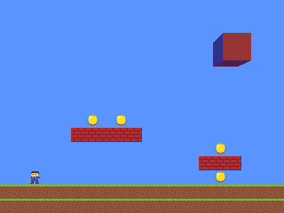
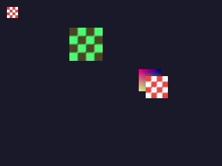
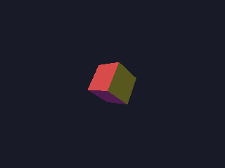
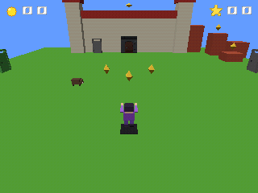
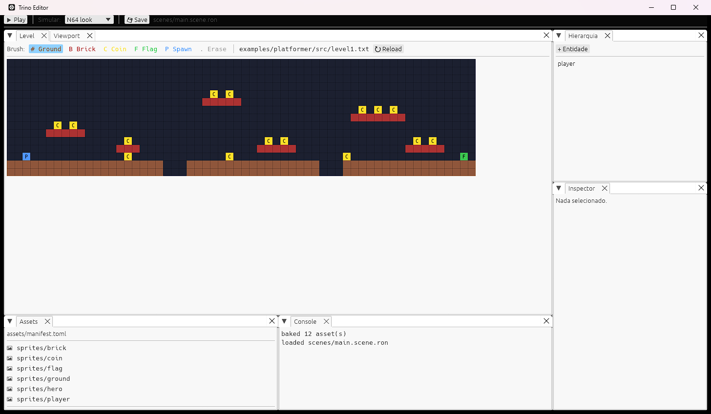

<div align="center">

# 🎮 Trino

**One Rust codebase. Three consoles.**
A game engine that ships the same game to **Nintendo 64**, **Nintendo 3DS** and **PC** —
with a modern visual editor, live reload, and console-accurate preview modes.

[](https://github.com/vitorjordao/Trino/actions/workflows/ci.yml)
[](LICENSE-MIT)
[](rust-toolchain.toml)



*The showcase platformer, played by the engine's test bot and recorded straight from the
real renderer with the N64 look — one Rust crate, boots as a `.z64` on N64, a `.3dsx`
on 3DS and a native window on PC.*

</div>

---

## Why Trino?

- 🕹️ **Write once, run on real retro hardware.** Your game code depends on one small,
  `no_std` crate — the engine maps it to libdragon (N64), libctru/citro2d (3DS) and
  wgpu (PC).
- 🖥️ **A real editor.** Unity-style viewport, scene hierarchy, inspector, asset
  browser and a tilemap **Level painter**, built with egui. Press play, edit assets,
  watch them hot-reload.
- 🔀 **Two-way file sync.** Levels are plain ASCII and scenes are RON: paint in the
  editor and the file saves instantly; let an AI agent (or any tool) edit the file and
  the editor updates live. The file is always the source of truth.
- 📺 **Console simulation on PC.** Preview with N64 3-point filtering, RGBA5551 dither
  and 320×240 output — or strict mode, which *fails the frame* when content busts the
  N64's 4 KB TMEM or triangle budgets.
- 🔁 **Live reload everywhere.** Game code reloads as a dylib on PC; ROMs rebuild and
  relaunch in the emulator on file save (`cargo xtask watch n64|3ds`).
- 🧪 **Emulator-tested.** `cargo xtask test n64|3ds` boots your game in ares/Azahar and
  asserts on the debug channel; golden-image tests cover the renderer.
- 🎲 **Vertex-lit 3D** on all three targets from one deterministic software T&L
  pipeline (glTF masters → portable TMDL meshes).
- 🤖 **AI-friendly by default.** The repo — and every game scaffolded by
  `cargo xtask new` — ships `AGENTS.md` and Claude Code skills, so AI agents are
  productive from clone.

## Status

**All 9 roadmap phases implemented** — a complete 2D platformer plus **castle64**, a
SM64-style 3D showcase (hub + 3 stages, articulated character with inertial movement,
z-buffered software T&L, a CC0 KayKit prop baked from textured glTF), run identically
on all three targets; real ROMs boot in ares and Azahar with automated in-emulator
test harnesses — including a bot that *plays* a full castle64 stage inside the
emulators; `cargo xtask new` scaffolds AI-friendly game crates; releases are
automated. The roadmap with per-phase acceptance criteria lives in
[PLANO_EXECUCAO_TRINO.md](PLANO_EXECUCAO_TRINO.md).

| | PC | Nintendo 64 | Nintendo 3DS |
|---|---|---|---|
| Window/boot | ✅ | ✅ `.z64` in ares | ✅ `.3dsx` in Azahar |
| 2D sprites, input, audio | ✅ | ✅ | ✅ |
| Tilemap, collision, camera, music | ✅ | ✅ | ✅ |
| Console-sim + golden tests | ✅ | ✅ N64 look (3-point, RGBA5551 dither) | ✅ 400×240 + bilinear |
| Asset pipeline + live reload | ✅ | ✅ (rebuild + relaunch loop) | ✅ (rebuild + relaunch loop) |
| Emulator test harness | — | ✅ ISViewer magic strings | ✅ svcOutputDebugString |
| Visual editor + Level painter (two-way file sync) | ✅ | — | — |
| 3D (vertex-lit `draw_model`) | ✅ | ✅ | ✅ |

### In pictures

| N64 look on PC | Software-T&L 3D |
|---|---|
|  |  |
| 3-point filtering + the RDP's magic-square dither, quantized to RGBA5551 — emulated in the PC shader so what you see is what the console shows. | glTF → TMDL → deterministic CPU transform & lighting; the consoles only rasterize colored triangles (`rdpq_triangle` / `C2D_DrawTriangle`). |

| castle64 — the 3D showcase | |
|---|---|
|  | Hub + 3 platforming stages on all three consoles: z-buffered occlusion, per-draw tint, an articulated character, and a real CC0 KayKit doorway baked from textured glTF into vertex colors. A deterministic bot plays it end-to-end in the test suite (`docs/media/castle64.gif`). |

## Quickstart

```sh
git clone https://github.com/vitorjordao/Trino
cd Trino
cargo xtask run pc     # play castle64, the 3D showcase (N64 look by default)
cargo xtask editor     # open the visual editor
cargo xtask test       # full test suite — same gates as CI
```

That's it for PC. For the consoles:

- **N64** — Docker + the [ares](https://ares-emu.net/) emulator at `ares-v148/`
  in the repo root.
- **3DS** — a local [devkitPro](https://devkitpro.org) install (`3ds-dev`
  packages) + the [Azahar](https://azahar-emu.org/) emulator.

```sh
cargo xtask run n64    # build target/n64/trino.z64 + open it in ares
cargo xtask run 3ds    # build target/3ds/trino.3dsx + open it in Azahar
cargo xtask test n64   # boot a test ROM, assert on the debug channel
cargo xtask test 3ds   # same, through Azahar's log
cargo xtask watch n64  # rebuild + relaunch on every save (3ds too)
```

See [CONTRIBUTING.md](CONTRIBUTING.md) for setup details.

## The editor — built for humans *and* AI agents



The **Level** tab paints the platformer's tilemap. Every stroke saves straight to
`examples/platformer/src/level1.txt` — plain ASCII, one character per tile. That file
is the single source of truth, and the sync is **two-way**: edit it with any tool (or
ask an AI agent to redesign the level) and the editor picks the change up live through
its file watcher. The scene file (`scenes/*.scene.ron`) gets the same treatment.

```text
..P............C............C..............C..............F.
####################...#################...#################
```
*A level is just text — trivially diffable, reviewable and AI-editable.*

## How it works

```
            ┌──────────── your game ────────────┐
            │   depends ONLY on trino-core      │
            └───────────────┬───────────────────┘
                            ▼
            trino-core  (traits + math, no_std, zero deps)
                            ▲
        ┌───────────────────┼───────────────────┐
  platform-pc         platform-n64         platform-3ds
  (wgpu/winit)        (libdragon FFI)      (ctru/citro FFI)
```

- **Materials are presets, not shaders** — the N64's RDP is the design ceiling, so
  everything the engine exposes runs on all three targets.
- **Assets have shared masters + per-platform overrides**; a format a console can't
  represent is a build error, never a silent fallback.
- **Everything goes through `cargo xtask`** — build, run, test, bake assets, watch,
  scaffold. No per-platform incantations to memorize.

## Creating a game

```sh
cargo xtask new my-game    # scaffolds examples/my-game (game code + AGENTS.md)
cargo test -p my-game      # its tests join the workspace suite immediately
```

Game crates depend only on `trino-core` — the dependency-direction test enforces it —
so anything you build runs on all three targets by construction. Standalone project
scaffolding (outside this repo) lands once the engine crates are published.

## Working on Trino (humans & AIs)

Start with [AGENTS.md](AGENTS.md) — repository map, architecture rules, commands and
pitfalls. Using Claude Code? It picks the guide up automatically, and the
`.claude/skills/` folder teaches it the project's workflows.

## Contributing

PRs welcome — see [CONTRIBUTING.md](CONTRIBUTING.md). Every feature lands with tests.

## License

Dual-licensed under [MIT](LICENSE-MIT) or [Apache-2.0](LICENSE-APACHE), at your option.
